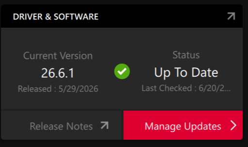

# LLM From Scratch by Me

Me learning LLM from scratch.

## AMD Radeon RX 9070 XT + PyTorch + ROCm 7.2 + ROCDXG on WSL2

This document describes a working setup for running PyTorch on an AMD Radeon RX 9070 XT inside WSL2 using ROCm 7.2, ROCDXG, and a `uv` managed Python virtual environment.

### Environment

#### Hardware

- GPU: AMD Radeon RX 9070 XT
- CPU: AMD Ryzen 7 9800X3D

#### Software

- Windows 11
- Adrenaline 26.6.1
  
- WSL2
- Ubuntu 24.04 LTS
- ROCm 7.2
- ROCDXG
- Python 3.12
- uv
- PyTorch 2.9.1

---

### 1. Install AMD Adrenalin Driver on Windows

Install the latest AMD Adrenalin driver with WSL ROCm support.

After installation, verify that WSL exposes:

```bash
ls /dev/dxg
```

Expected output:

```text
/dev/dxg
```

---

### 2. Install ROCm for WSL

Download and install the AMD package repository.

Example working package:

```bash
wget https://repo.radeon.com/amdgpu-install/7.2.1/ubuntu/noble/amdgpu-install_7.2.1.70201-1_all.deb

sudo apt install ./amdgpu-install_7.2.1.70201-1_all.deb
```

Install ROCm userspace components:

```bash
sudo amdgpu-install -y --usecase=wsl,rocm --no-dkms
```

The `--no-dkms` flag is important because WSL does not use Linux kernel GPU drivers.

---

### 3. Build and Install ROCDXG

ROCDXG provides the bridge between ROCm and the Windows DXG interface exposed inside WSL.

Clone the repository:

```bash
git clone https://github.com/ROCm/librocdxg.git
cd librocdxg
```

#### Windows SDK

This setup used:

```text
C:\Program Files (x86)\Windows Kits\10\Include\10.0.28000.0
```

Inside WSL this path becomes:

```text
/mnt/c/Program Files (x86)/Windows Kits/10/Include/10.0.28000.0
```

#### Build

```bash
export win_sdk="/mnt/c/Program Files (x86)/Windows Kits/10/Include/10.0.28000.0"

mkdir build
cd build

cmake .. -DWIN_SDK="${win_sdk}/shared"

make -j$(nproc)

sudo make install
```

---

### 4. Enable ROCDXG Detection

Add the following to your shell configuration:

```bash
echo 'export HSA_ENABLE_DXG_DETECTION=1' >> ~/.zshrc
```

Reload:

```bash
source ~/.zshrc
```

Verify:

```bash
echo $HSA_ENABLE_DXG_DETECTION
```

Expected:

```text
1
```

---

### 5. Verify ROCm

Verify that ROCm can see the GPU:

```bash
rocminfo
```

Expected output should include:

```text
Marketing Name: AMD Radeon RX 9070 XT
Name: gfx1201
```

Example:

```text
Agent 2

Name: gfx1201
Marketing Name: AMD Radeon RX 9070 XT
Device Type: GPU
```

---

### 6. Create Python Environment with uv

Create a virtual environment:

```bash
uv venv --python 3.12
source .venv/bin/activate
```

Upgrade pip:

```bash
uv pip install --upgrade pip
```

---

### 7. Install PyTorch

The default PyPI build may install newer nightly packages that currently crash with ROCDXG.

Use the ROCm 7.2.3 wheel repository and install the validated PyTorch release:

```bash
uv pip install \
    torch==2.9.1 \
    torchvision==0.24.0 \
    torchaudio==2.9.0 \
    -f https://repo.radeon.com/rocm/manylinux/rocm-rel-7.2.3/
```

Verify installation:

```bash
python -c "import torch; print(torch.__version__)"
```

Expected:

```text
2.9.1+rocm7.2.3
```

---

### 8. Verify GPU Access from PyTorch

Run:

```python
import torch

print("torch:", torch.__version__)
print("hip:", torch.version.hip)
print("available:", torch.cuda.is_available())
print("count:", torch.cuda.device_count())

if torch.cuda.is_available():
    print(torch.cuda.get_device_name(0))

    x = torch.randn(1024, 1024, device="cuda")
    y = x @ x

    print(y.mean())
```

Expected output:

```text
available: True
count: 1
AMD Radeon RX 9070 XT
tensor(..., device='cuda:0')
```

Note that PyTorch still uses the `cuda` API name even when running on AMD hardware through ROCm/HIP.

---

### Known Issues

#### PyTorch Nightly Crash

The following version crashed during testing:

```text
torch 2.12.1+rocm7.2
```

Error:

```text
Found 0 rocprofiler agents and 2 HSA agents
```

Using:

```text
torch 2.9.1+rocm7.2.3
```

resolved the issue.

#### Signal Leak Warning

On shutdown you may see:

```text
Warning: Resource leak detected by SharedSignalPool, 2 Signals leaked.
```

This warning did not prevent successful GPU execution.

---

### Working Configuration Summary

```text
Windows 11
WSL2 Ubuntu 24.04
AMD Radeon RX 9070 XT
ROCm 7.2
ROCDXG
Python 3.12
uv
PyTorch 2.9.1+rocm7.2.3
HSA_ENABLE_DXG_DETECTION=1
```

Successful verification:

```text
torch.cuda.is_available() == True
torch.cuda.device_count() == 1
torch.cuda.get_device_name(0) == "AMD Radeon RX 9070 XT"
```
